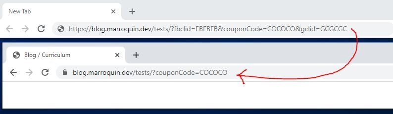

# Tracking Query Remover

A Manifest V3 Chrome and Firefox extension that removes tracking parameters from URLs, making links cleaner and easier to share.



The extension removes common campaign, click, email, and affiliate identifiers, including:

* Google, Microsoft, Meta, TikTok, LinkedIn, Pinterest, Reddit, Snapchat, X, and Yandex click IDs
* `utm_*`, `mtm_*`, `hsa_*`, and other campaign-attribution families
* HubSpot, Klaviyo, Mailchimp, Marketo, Matomo, Salesforce Marketing Cloud, and Vero identifiers
* Domain-specific share parameters from YouTube, Spotify, Instagram, Reddit, Facebook, and X
* Domain-specific affiliate parameters from Amazon and eBay

Generic parameter names are removed only on domains where their meaning is known, and only on the subdomains that serve those pages, so names such as `tag`, `ref`, or `client` are left alone on `aws.amazon.com` or `docs.google.com`. Functional parameters for videos, searches, authentication, and application state are preserved, including the eBay listing variation (`var`) and the identifiers that resolve LinkedIn email links (`eid`, `midToken`, `midSig`). Email identifiers are also preserved on unsubscribe, subscription-management, preference, and browser-view pages.

The extension cleans the address bar after the initial page request. It does not block the website from receiving parameters included in that first request. It does not collect, transmit, or store browsing data.

## Per-site control

Click the toolbar icon to turn cleaning off for the site you are on. The list of disabled sites is kept in browser storage and covers subdomains, so disabling `example.com` also disables `shop.example.com`. Reload the page after changing the setting.

## Permissions

* `http://*/*` and `https://*/*` to read the address of ordinary web pages. Local files and other schemes are never touched
* `storage` to remember the sites you turned off
* `activeTab` so the popup can show the hostname of the current tab

The [privacy policy](https://query.marroquin.dev/) covers what the extension does and does not do with that access.

## Install

You can install the extension/add-on for the following browsers:

* [Google Chrome](https://chrome.google.com/webstore/detail/tracking-query-remover/cdhgohknmmkonojeajegbnkbmfkkhobb)
* [Mozilla Firefox](https://addons.mozilla.org/en-US/firefox/addon/tracking-query-remover/)

## Tests

Run the automated test suite with Node.js:

```shell
node --test test/content.test.js
```

Or test it manually by visiting `https://blog.marroquin.dev/tests/?fbclid=FBFBFB&couponCode=COCOCO&gclid=GCGCGC`. The tracking parameters should disappear while `couponCode` remains.

In order to test this extension:

For Chrome at `chrome://extensions`, enable **Developer mode** and click **Load unpacked**.

For Firefox at `about:debugging#/runtime/this-firefox`, click **Load Temporary Add-on…**.

## Links

Some links that may help you if you are also new to building extensions

* [Manifest file format](https://developer.chrome.com/docs/extensions/reference/manifest)
* [Migrate to Manifest V3](https://developer.chrome.com/docs/extensions/develop/migrate)

## Icon

The icon was created with **GIMP** on a 16x16 pixel canvas using a size 1 pencil. You can edit it by opening [icon.xcf](icon.xcf).

## Package extension

Create a ZIP containing `manifest.json`, `content.js`, `popup.html`, `popup.js`, and the PNG icons, then upload it from the **Package** tab in the Chrome Web Store Developer Dashboard.

```shell
mkdir -p dist && zip -j "dist/tracking-query-remover-$(node -p "require('./manifest.json').version").zip" manifest.json content.js popup.html popup.js icon16.png icon48.png icon128.png
```

Each Chrome Web Store update must use a version number higher than the currently published version.
